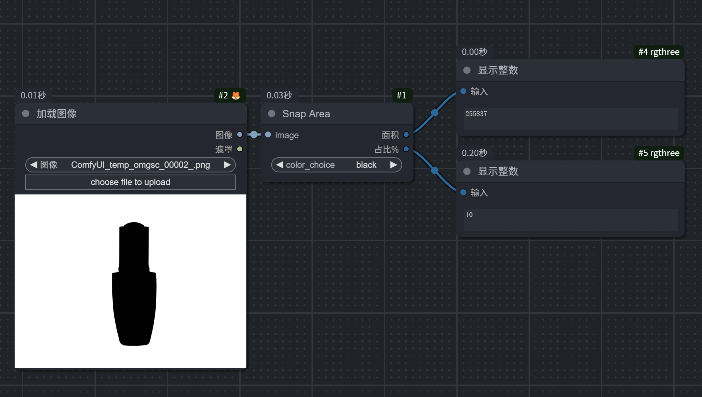
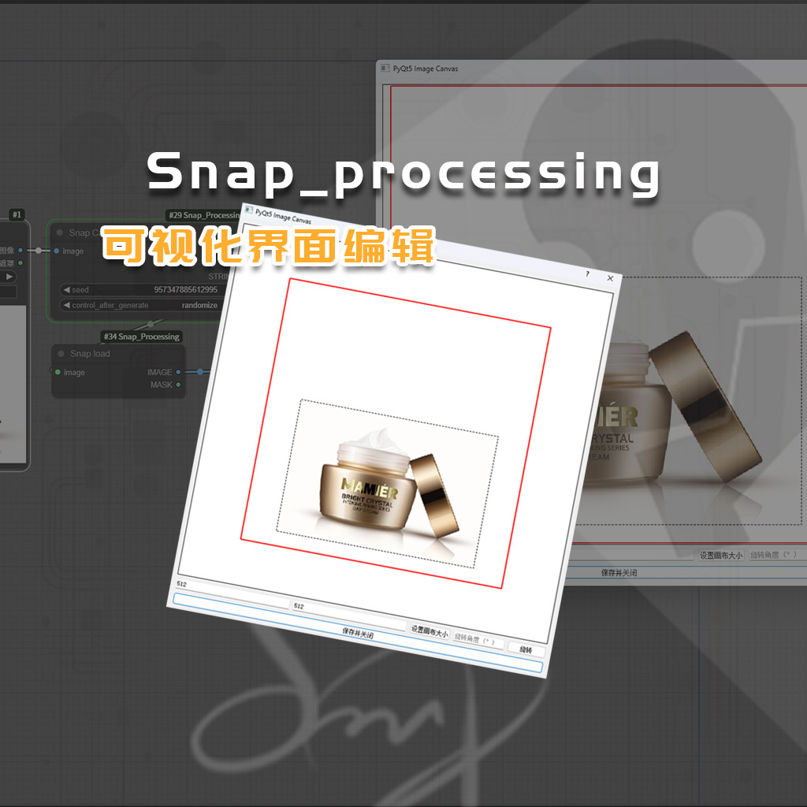
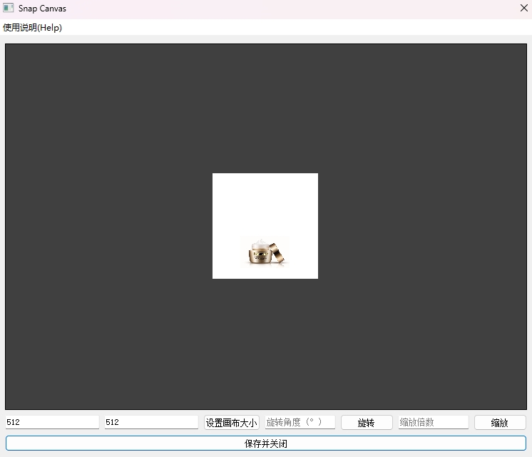

## Update
#### 我更新了SnapCanvas节点用于可视化创建画布，及拖动/缩放输入图像

### 简述

##### 创建这个仓库是没有办法的办法，因为我没有找到一个可以在comfyui中完成面积大小及面积占比化整的节点，所以不得不自己创建一个节点配合我的“Majic product”工作流完成自动化运行

##### Creating this repository was a last resort because I couldn't find a node in ComfyUI that calculates area size and ratio, so I had to create a custom node to integrate with my 'Majic product' workflow for automated execution.

### 使用方法
   ```bash
   https://github.com/SS-snap/Snap-Processing.git
   ```
克隆仓库到你的自定义节点目录中
Clone the repository into your custom node directory

## SnapArea nodes


#### 上面的“面积”输出为面积总数，下面的“占比%”输出为所选颜色面积占比化整
#### The "Area" above is the total area, and the "Proportion%" below is the area percentage of the selected color.


## SnapCanvas nodes


[Download the video](ComfyUI-Snap_Processing/assets/SP.mp4)

在comfyui运行至snapcanvas节点时，阻断工作流，pyqt5界面会自动弹出，你可以设置画布大小并点击set canvas size，也可以利用鼠标滚轮或拖拽图像右下角对输入图像进行缩放，还可以进行旋转以及拖动图像位置。最后点击save and close，阻断关闭，工作流继续运行

When the workflow reaches the SnapCanvas node in ComfyUI, it will pause, and the PyQt5 interface will automatically pop up. You can set the canvas size and click "Set Canvas Size," or use the mouse wheel or drag the bottom-right corner of the input image to scale it. Finally, click "Save and Close," and the workflow will resume.

找到我
Wechat:SmartCanvas303
douyin:SmartCanvas303
